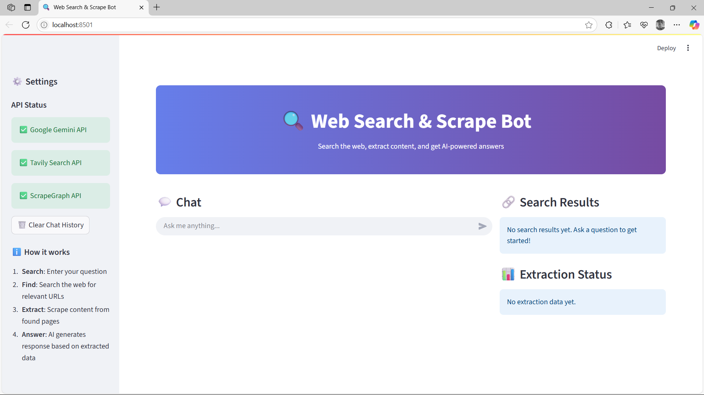

# 🧠 Web Search & Scrape Bot - Technical Documentation




## 🔍 Overview

The **Web Search & Scrape Bot** is a Streamlit-based multimodal assistant that allows users to input a query, perform a real-time web search, extract structured information from discovered URLs, and generate a coherent answer using a Large Language Model (LLM).

---

## 🏗️ System Architecture

```mermaid
flowchart TD
    UI[User Interface - Streamlit] -->|User Query| Controller[Main App Controller]
    Controller -->|Initialize| EnvChecker[.env Validator]
    Controller -->|Configure| Init[Initialize LLM, Search Tool, Memory]
    Controller -->|Search| SearchModule[Tavily Search API]
    Controller -->|Scrape| ScraperModule[ScrapeGraph API via scrapegraph_py]
    Controller -->|Generate| LLMModule[Gemini Pro (Google GenAI)]
    LLMModule -->|Response| UI
    ScraperModule -->|Store Data| MemorySaver
    Controller -->|Save Messages| SessionState[Streamlit SessionState]
```

---

## 🧰 Tech Stack

### 🎛️ UI Layer

* **Framework**: [Streamlit](https://streamlit.io/)

  * Interactive UI
  * Sidebar controls, chat input, and structured layout using columns
* **Custom Styling**: HTML + CSS via `unsafe_allow_html`

### 🧠 LLM Layer

* **Model**: `gemini-2.0-flash` via `langchain_google_genai`

  * Fast inference LLM by Google for real-time conversational reasoning
  * Integrated with LangChain to standardize message protocol

### 🔍 Web Search

* **Tool**: [`langchain_tavily`](https://docs.langchain.com/integrations/tools/tavily/)

  * Performs real-time web searches
  * Returns top N URLs relevant to the user's query

### 🕷️ Web Scraping

* **Library**: [`scrapegraph_py`](https://pypi.org/project/scrapegraph-py/)

  * SmartScraper module powered by LLMs to extract structured information from any URL
  * Abstracts away traditional scraping logic (selectors, parsing) with prompts
* **API Wrapper**: `Client.smartscraper()`

### 💾 State Management

* **Memory**: `MemorySaver` from `langgraph.checkpoint.memory`

  * Caches states and messages for graph execution
* **Session**: `st.session_state`

  * Tracks step progress, messages, search results, and scraped data

### ⚙️ Orchestration

* **Framework**: [`LangGraph`](https://github.com/langchain-ai/langgraph)

  * Defines a state machine with `START`, `END`, and node-based state transitions
  * Handles sequence flow: Search → Scrape → Response

---

## 📐 Components

### 1. **State Definition**

```python
class State(TypedDict):
    user_input: str
    messages: Annotated[list, add_messages]
    urls: list[str]
    extracted: list[str]
```

Each step operates on a shared `State`, maintaining coherence between search → scrape → generate stages.

---

## 🔐 Environment & Security

### Environment Variables

* `.env` based secure loading with `python-dotenv`
* Required keys:

  * `GOOGLE_API_KEY`
  * `TAVILY_API_KEY`
  * `SG` (ScrapeGraph API Key)

---

## 📦 Deployment

### Supported Platforms

* Localhost (for dev)
* Streamlit Community Cloud or Docker-based cloud environments

### `.env` Sample

```
GOOGLE_API_KEY=your_google_api_key
TAVILY_API_KEY=your_tavily_api_key
SG=your_scrapegraph_api_key
```

---

## 📊 Data Flow Summary

1. **User Input**: Natural language query
2. **Tavily Search**: Top 2 URLs fetched
3. **ScrapeGraph**: Content from each URL extracted with LLM
4. **LLM Prompt**: Custom prompt incorporating all scraped content
5. **LLM Response**: AI generates contextual answer
6. **Render**: UI shows answer, links, scraped content preview

---

## 🧱 Advanced Features

| Feature                     | Description                                  |
| --------------------------- | -------------------------------------------- |
| **LLM-Powered Scraping**    | Removes dependency on brittle HTML parsing   |
| **LangGraph State Control** | Modular, restartable, observable step system |
| **LLM Context Compression** | Only success content passed to LLM prompt    |
| **Custom Prompt Design**    | Dynamically tailored for each user query     |
| **Resource Caching**        | `@st.cache_resource` used for initialization |

---

## 📉 Limitations & Future Improvements

| Limitation              | Improvement Ideas                                  |
| ----------------------- | -------------------------------------------------- |
| Fixed LLM & Scrape Tool | Add toggle to choose between Gemini / GPT / Claude |
| Only Top 2 URLs         | Allow configurable number of search results        |
| No Authentication       | Add user login for session isolation               |
| Static Prompt           | Use dynamic prompt engineering or system messages  |

---

## 📎 Useful Links

* [Streamlit Docs](https://docs.streamlit.io/)
* [LangGraph GitHub](https://github.com/langchain-ai/langgraph)
* [Tavily API](https://www.tavily.com/)
* [ScrapeGraph AI](https://scrapegraph.ai/)
* [Google Gemini via LangChain](https://python.langchain.com/v0.1/docs/integrations/llms/google_generative_ai/)